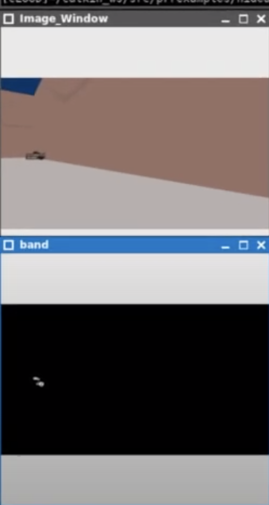
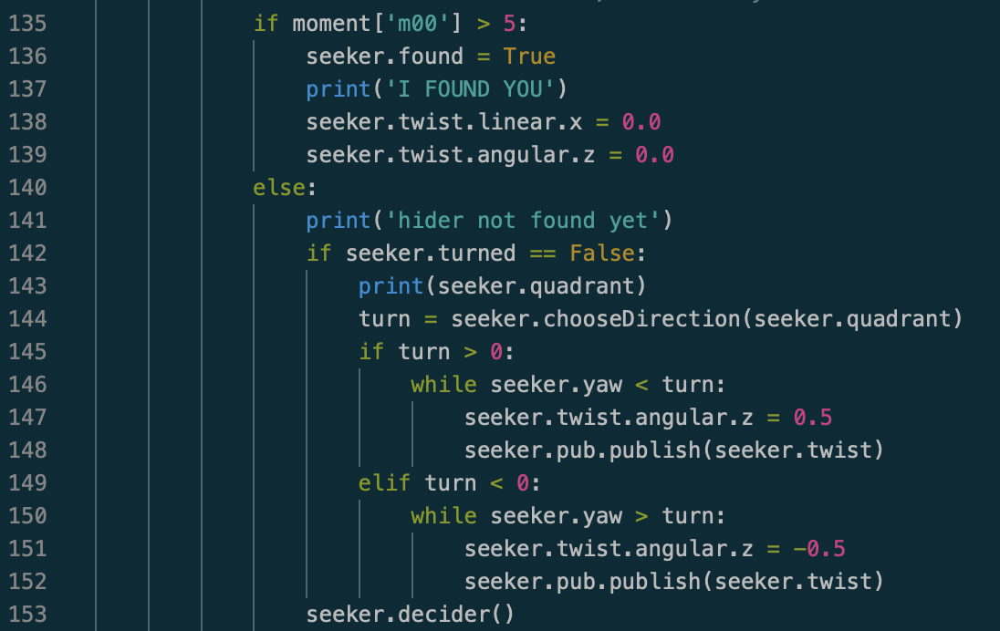

### The Seeker Algorithm

The seeker algorithm begins with the seeker waiting for a set period of time till the hider is able to hide. The code below shows how we got the seeker to wait 40 seconds before moving. In the scan callback function, we check whether the time passes has been more than 40, if not the seeker continues waiting. 

Like in the real game of hide and seek, the seekers' eyes represented by the computer vision are closed however, just like we would sense which direction someone is walking to to hide with our ears, the seeker senses this with it’s lidar readings already running. 

After the set period of hiding time is over, it has a good guess of which direction the hider walked towards. With the wall following algorithm, it makes it’s way to that area and uses open cv and computer vision to find the robot. Since the hider is black, the seeker will know it has found the hider when it see’s a color in that range as shown in these camera windows 

As you can see in the above picture, the top window shows the hider in the eyes of the seeker and the bottom window shows that the seeker has detected a color in the range we gave (black). When it detects this color, the seeker is then told to stop and print out "I FOUND YOU".

